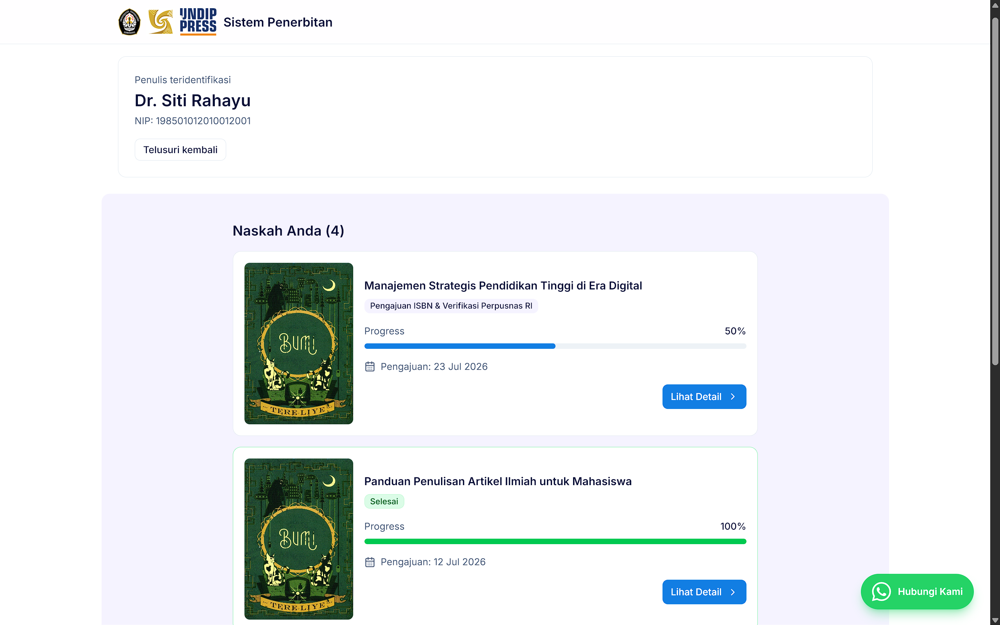
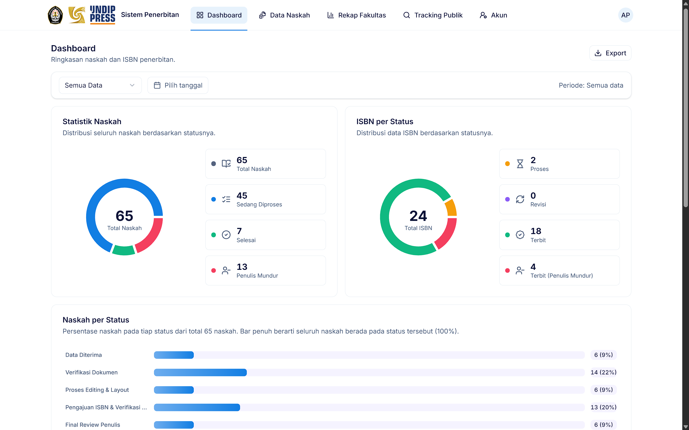

# 📚 Sistem Penerbitan

Aplikasi manajemen penerbitan naskah untuk **Universitas Diponegoro** — mengelola alur penerbitan buku dari pengajuan naskah, verifikasi dokumen, editing & layout, pengajuan ISBN, proof reading, hingga cetak dan serah terima. Dilengkapi **pelacakan publik** bagi penulis dan **dashboard admin** dengan statistik interaktif.

---

## 📸 Tangkapan Layar

### Publik

**Landing Page**


**Tracking Naskah**



**Detail Tracking**


### Admin

**Dashboard Admin**



---

## ✨ Fitur

### 🌐 Publik (tanpa login)

- **Tracking naskah** — penulis memantau progres lewat NIM/NIP, ditampilkan sebagai timeline bertahap
- **Aksi penulis** — unggah revisi dokumen, setujui/tolak *proof reading*, konfirmasi buku sudah diambil
- **Kontak admin** — tombol WhatsApp dengan pesan terisi otomatis

### 🔐 Admin

- **Dashboard** — donut chart statistik naskah & ISBN per status, distribusi status per tahapan, aktivitas terbaru
- **Filter periode** — preset (hari ini, 7/30 hari, 1 tahun) atau rentang tanggal kustom, berlaku untuk seluruh data dashboard & rekap
- **Export CSV** — dashboard, rekap fakultas, dan daftar naskah (mengikuti filter aktif)
- **Manajemen naskah** — CRUD, pencarian, filter fakultas/status/urutan, rentang tanggal, pagination, import/export CSV
- **Workflow transisi status** — riwayat lengkap siapa/kapan/status apa, catatan per transisi, upload layout, pencatatan ISBN
- **Rekap per fakultas** — agregat total, sedang diproses, selesai, penulis mundur, dan ISBN terbit + diagram batang
- **Manajemen akun admin** — buat/edit/hapus akun

## 🔁 Alur Status Naskah

| Tahap | Status | Progres |
|:-----:|--------|:-------:|
| 0 | Data Diterima | 5% |
| 1 | Verifikasi Dokumen / Revisi Dokumen | 10% |
| 2 | Proses Editing & Layout / Revisi | 20–25% |
| 3 | Pengajuan ISBN & Verifikasi Perpusnas RI / Revisi ISBN / ISBN Terbit | 45–60% |
| 4 | Final Review Penulis / Revisi / Acc Cetak | 65–75% |
| 5 | Proses Cetak | 85% |
| 6 | Siap Diambil | 95% |
| 7 | Selesai | 100% |
| — | Penulis Mundur | 100% |

> Status revisi tetap tampil di dalam tahap utamanya pada timeline, sehingga penulis selalu melihat posisi yang jelas.

## 🧰 Teknologi

| Layer | Teknologi |
|-------|-----------|
| Backend | Laravel 13, Fortify (autentikasi), Wayfinder (route type-safe) |
| Frontend | Inertia 3 + React 19 + TypeScript, Tailwind CSS v4, komponen Radix UI, Recharts |
| Kualitas | Pest, Pint, Larastan (PHPStan), ESLint, Prettier |

## 📋 Prasyarat

- PHP ≥ 8.3 + Composer
- Node.js ≥ 20 + npm
- SQLite (bawaan) atau MySQL/PostgreSQL

## 🚀 Instalasi

```bash
git clone <url-repo>
cd penerbitan

# Cara cepat — install, key, migrate, build:
composer run setup

# Atau manual:
composer install
copy .env.example .env
php artisan key:generate
php artisan migrate --seed
npm install && npm run build
```

> Default `.env` memakai SQLite (`database/database.sqlite`). Untuk MySQL/PostgreSQL, sesuaikan blok `DB_*` di `.env`.

## 👤 Akun Demo

| Peran | Email | Kata Sandi |
|-------|-------|------------|
| Admin | `admin@example.com` | `password` |

Coba tracking publik dengan NIM **`2112345001`** (Budi Santoso).

Seeder tambahan untuk data uji:

```bash
php artisan db:seed --class=DummyNaskahSeeder    # naskah dummy acak
php artisan db:seed --class=RekapFakultasSeeder  # sebaran naskah 10 fakultas
```

## 🛠 Pengembangan

```bash
composer dev        # php artisan serve + queue:listen + vite (bersamaan)
npm run dev         # vite saja
npm run build       # build produksi
npm run build:ssr   # build produksi + SSR
```

### Pemeriksaan Kualitas

```bash
composer test       # pint + phpstan + pest
composer ci:check   # eslint + prettier + tsc + test
npm run lint:check  # eslint
npm run types:check # tsc --noEmit
```

## 🗂 Struktur Penting

```
app/
├── Enums/NaskahStatus.php      # 15 status + tahapan + progres
├── Http/Controllers/Admin/     # Dashboard, Naskah, Workflow, RekapFakultas, Akun
├── Services/WorkflowService.php# Mesin transisi status + riwayat
resources/js/
├── components/                 # UI (Radix/shadcn-style), DonutStatCard, PeriodFilterCard
└── pages/
    ├── tracking/               # Halaman publik pelacakan
    └── admin/                  # Dashboard, naskah, rekap-fakultas, akun
routes/web.php                  # Rute publik + admin (prefix admin)
```
